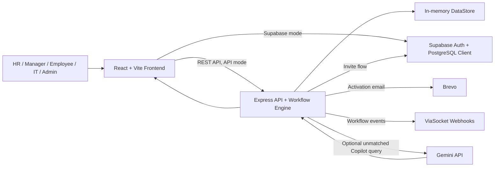

# IKIGAI Judging Brief — OnboardOS

**Track:** AI Frontiers and Smart Systems  
**Problem:** Employee onboarding spans HR, managers, IT, and multiple access tools, creating delayed provisioning, unclear ownership, and unresolved dependency blockers.  
**Repository assessment:** OnboardOS implements a multi-role onboarding workflow with deterministic task dependencies and AI-assisted recommendation/Copilot interfaces; several external integrations and production persistence remain partial or unverified.

## What They Built

- Role-specific HR, Manager, Employee, IT, and Admin workspaces with protected client routes.
- HR employee creation/bulk intake, activation invitation generation, employee profile completion, and HR approval endpoints.
- An onboarding task workflow in which completion/failure propagates through a dependency graph; the seeded Jira failure blocks AWS provisioning.
- Employee access-claim and manager approval paths with audit/event dispatch hooks.
- A role-fit interface that combines seeded outcome and skill-fit scores, plus a Copilot service that can call Gemini only when configured.

## Architecture

## Core Capability Check

| Capability | Status | Evidence |
|---|---|---|
| Role-specific portals and client-side route guards | ✅ Verified | `frontend/src/App.tsx`, `frontend/src/components/auth/RoleRoute.tsx` |
| HR employee creation, profile completion, and HR approval endpoints | ✅ Verified | `backend/src/routes/employeeRoutes.ts` |
| Dependency-aware onboarding tasks: Jira failure blocks downstream AWS task | ✅ Verified | `backend/src/db/store.ts`, `backend/src/services/orchestrator/workflowEngine.ts`, `backend/src/services/orchestrator/dagEngine.ts` |
| Access claim and approval workflow with audit/webhook dispatch hooks | 🟡 Partial — handlers exist; live third-party delivery is not verified | `backend/src/routes/claimAutomationRoutes.ts`, `backend/src/routes/governanceRoutes.ts`, `backend/src/services/viasocketAutomation.ts` |
| Role-fit recommendation and recovery-plan UI | 🟡 Partial — calculations/UI exist, but candidate and project inputs are static seeded demo data | `frontend/src/pages/analysis/AIRoleRecommendationPage.tsx`, `frontend/src/pages/analysis/analysisData.ts` |
| Gemini Copilot fallback | 🟡 Partial — server integration is conditional on `GEMINI_API_KEY`; live configuration is not verified | `backend/src/services/copilotService.ts`, `backend/src/config/env.ts` |
| Supabase-backed persistent workflow state | 🟡 Partial — frontend Supabase client/migration exist, but core backend workflow state uses in-memory `store.ts` | `frontend/src/services/supabase/supabaseClient.ts`, `supabase/migrations/20260822000001_employee_profile_approval_workflow.sql`, `backend/src/db/store.ts` |

## Technical Read

**Strongest technical aspect:** The DAG-style workflow separates deterministic access decisions and dependency propagation from AI-facing explanation/recommendation features.

**Biggest technical concern:** The primary backend workflow store is in-memory, so production durability is not demonstrated; external email and Gemini execution require configuration and live proof.

**Core workflow:** Partial  
**Implementation confidence:** Medium

## Judge Metrics

| Metric | Assessment |
|---|---|
| Technical Ambition | 4/5 |
| Architecture Quality | 3/5 |
| Engineering Quality | 3/5 |
| Demo Risk | Medium |

## IKIGAI Score

| Criterion | Score |
|---|---:|
| Innovation & Creativity | 20/25 |
| Technical Implementation | 20/30 |
| Problem Solving | 17/20 |
| UI/UX & Presentation | 7/10 (repository evidence only) |
| Impact & Scalability | 10/15 |
| **Total** | **74/100** |

## Ask the Team

1. The role-fit score combines outcome and skill-fit at 50% each in `AIRoleRecommendationPage.tsx`; which inputs are collected from real systems versus the seeded `analysisData.ts` dataset?
2. How is the `backend/src/db/store.ts` workflow state persisted across a server restart, and what is the migration path to Supabase/PostgreSQL for production?
3. Can you demonstrate an employee completing a profile, an HR approval, and the resulting task/access state change through API mode rather than mock mode?
4. What safe behaviour is shown when `GEMINI_API_KEY` is absent or the Gemini API fails, and how do you keep AI from making access-control decisions?
5. Can you demonstrate provider-side evidence for one Brevo email or ViaSocket webhook, rather than only a local dispatch attempt?
