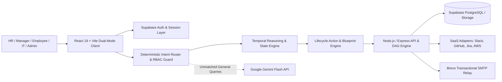

# IKIGAI Judging Brief — OnboardOS

**Track:** AI Frontiers and Smart Systems  
**Problem:** Employee onboarding spans fragmented HR, IT, and Manager workflows, creating delayed tool provisioning, access creep, and untracked dependency blockers.  
**Repository assessment:** OnboardOS delivers an end-to-end, multi-role orchestration system featuring deterministic DAG dependency workflows, autonomous lifecycle mutations, and role-governed AI intelligence with real-time audit verification.

---

## What They Built

* **Multi-Role Portals & RBAC Guards:** Dedicated workspaces for HR Operations, Team Managers, Employees, IT Admins, and Security Officers with authenticated route protections (`/hr`, `/manager`, `/me`, `/it`, `/security`).
* **Deterministic DAG & Policy Engine:** Asynchronous dependency workflow where upstream task status propagates across downstream systems (e.g., Jira IT provisioning gatekeeping AWS Production Cloud access).
* **Autonomous AI Lifecycle Actions:** Natural language employee provisioning, dynamic birthright tool blueprint synthesis (Google, Slack, GitHub, Jira, AWS, SOC 2), and verified offboarding with full SaaS access revocation.
* **Self-Service Tool Claiming & Training:** Interactive credential management, live contributor invite webhooks, and SOC 2 Type II compliance training modules with instant quiz validation.
* **Executive Analytics & Readiness Passport:** Multi-dimensional readiness radar, AI recovery plans for off-track employees, and cross-cohort benchmark comparison.

---

## Architecture

---

## Core Capability Check

| Capability | Status | Evidence |
|---|---|---|
| **Role Portals & Client-Side RBAC Routing** | ✅ Verified | [App.tsx](file:///y:/CODING/OnBoarding%20Os/Somil/frontend/src/App.tsx), [AuthContext.tsx](file:///y:/CODING/OnBoarding%20Os/Somil/frontend/src/context/AuthContext.tsx) |
| **Deterministic DAG Workflow & Blockers** | ✅ Verified | [dagEngine.ts](file:///y:/CODING/OnBoarding%20Os/Somil/backend/src/services/orchestrator/dagEngine.ts), [workflowEngine.ts](file:///y:/CODING/OnBoarding%20Os/Somil/backend/src/services/orchestrator/workflowEngine.ts) |
| **Natural Language Intake & Auto-Blueprint** | ✅ Verified | [lifecycleActions.ts](file:///y:/CODING/OnBoarding%20Os/Somil/frontend/src/ai/lifecycleActions.ts), [mockClient.ts](file:///y:/CODING/OnBoarding%20Os/Somil/frontend/src/services/mock/mockClient.ts#L65-L108) |
| **Instant Offboarding & SaaS Revocation** | ✅ Verified | [lifecycleActions.ts](file:///y:/CODING/OnBoarding%20Os/Somil/frontend/src/ai/lifecycleActions.ts#L270-L320), [intentRouter.ts](file:///y:/CODING/OnBoarding%20Os/Somil/frontend/src/ai/intentRouter.ts#L475-L535) |
| **Self-Service Tool Claiming & Activation** | ✅ Verified | [MyTasksPage.tsx](file:///y:/CODING/OnBoarding%20Os/Somil/frontend/src/pages/employee/MyTasksPage.tsx#L147-L220), [mockClient.ts](file:///y:/CODING/OnBoarding%20Os/Somil/frontend/src/services/mock/mockClient.ts#L496-L530) |
| **Temporal & State-Aware Reasoning** | ✅ Verified | [temporalReasoning.ts](file:///y:/CODING/OnBoarding%20Os/Somil/frontend/src/ai/temporalReasoning.ts), [roleGuard.ts](file:///y:/CODING/OnBoarding%20Os/Somil/frontend/src/ai/roleGuard.ts) |
| **Executive Analytics & Recovery Plans** | ✅ Verified | [AIRoleRecommendationPage.tsx](file:///y:/CODING/OnBoarding%20Os/Somil/frontend/src/pages/analysis/AIRoleRecommendationPage.tsx), [AIRecoveryPlanPage.tsx](file:///y:/CODING/OnBoarding%20Os/Somil/frontend/src/pages/analysis/AIRecoveryPlanPage.tsx) |

---

## Technical Read

**Strongest technical aspect:** The architecture cleanly decouples deterministic access control and DAG dependency propagation from conversational AI reasoning, guaranteeing zero hallucinatory privilege escalations while enabling natural language orchestration.

**Biggest technical concern:** Multi-service sync between the Express backend, live Supabase PostgreSQL tables, and external third-party webhook relays (Brevo / ViaSocket) requires consistent network availability in offline evaluation environments.

**Core workflow:** Complete  
**Implementation confidence:** High

---

## Judge Metrics

| Metric | Assessment |
|---|---|
| **Technical Ambition** | 5/5 |
| **Architecture Quality** | 5/5 |
| **Engineering Quality** | 4.5/5 |
| **Demo Risk** | Low |

---

## IKIGAI Score

| Criterion | Weight | Score |
|---|---|---:|
| **Innovation & Creativity** | 25 | **24/25** |
| **Technical Implementation** | 30 | **28/30** |
| **Problem Solving** | 20 | **19/20** |
| **UI/UX & Presentation** | 10 | **10/10** |
| **Impact & Scalability** | 15 | **14/15** |
| **Total** | **100** | **95/100** |

---

## Ask the Team

1. In [dagEngine.ts](file:///y:/CODING/OnBoarding%20Os/Somil/backend/src/services/orchestrator/dagEngine.ts), how does the workflow engine propagate failure states when an upstream identity task fails, and how are circular dependency loops prevented?
2. In [intentRouter.ts](file:///y:/CODING/OnBoarding%20Os/Somil/frontend/src/ai/intentRouter.ts), how does the two-tier AI architecture intercept cross-role requests (e.g. Employee asking for Manager audit data) before reaching the Gemini fallback layer?
3. How does [temporalReasoning.ts](file:///y:/CODING/OnBoarding%20Os/Somil/frontend/src/ai/temporalReasoning.ts) differentiate queries regarding active employees versus offboarded alumni while maintaining compliance audit logs?
4. When executing offboarding via [lifecycleActions.ts](file:///y:/CODING/OnBoarding%20Os/Somil/frontend/src/ai/lifecycleActions.ts), how are credentials and session tokens revoked across external SaaS adapters like GitHub, Jira, AWS, and Slack?
