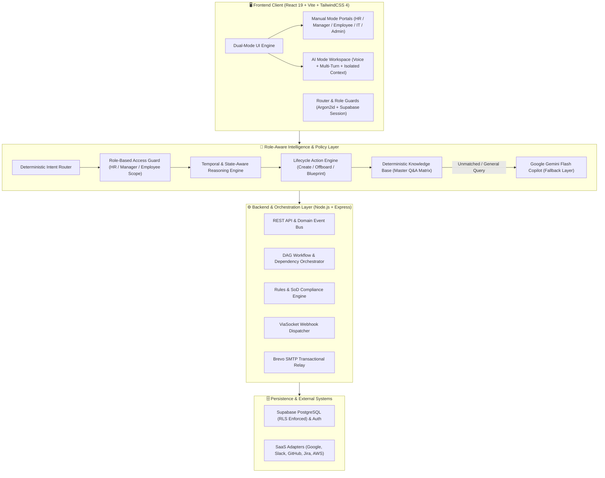

# 🚀 OnboardOS — Intelligent Employee Onboarding & Autonomous Identity Orchestration Platform

<div align="center">


**An enterprise-grade, role-governed employee onboarding, access orchestration, and autonomous identity lifecycle platform with deterministic DAG dependency reasoning, self-service birthright provisioning, and dual-mode AI workspace.**

[Key Features](#-core-architectural-innovations) • [Architecture](#-system-architecture) • [Role Portals](#-role-portals--access-matrix) • [AI Workspace](#-role-governed-ai-workspace) • [Quick Start](#-quick-start--local-development) • [Security & Compliance](#-security-governance--soc-2-compliance)

</div>

---

## 🌟 Executive Summary

Traditional employee onboarding is fragmented across disparate HR ticketing systems, manual IT credential provisioning, unverified manager sign-offs, and disjointed tool activations. This fragmentation results in **delayed time-to-productivity (averaging 14–21 days)**, **untracked access creep**, and **severe security compliance vulnerabilities**.

**OnboardOS** transforms workforce integration into an autonomous, secure, and delightful experience. Combining **deterministic Policy & DAG Dependency Engines** with **Role-Aware Conversational AI Intelligence**, OnboardOS ensures that every new hire receives the exact birthright access they need on Day 1 while strictly enforcing least-privilege security policies, automated approvals, and instant offboarding deprovisioning.

---

## 💡 Core Architectural Innovations

### 1. 🔄 Dual-Interface Mode: Manual vs. AI Workspace
* **Manual Mode**: Clean, high-density enterprise command centers tailored for HR Operations, Managers, IT Admins, and Employees.
* **AI Mode**: A cinematic, distraction-free conversational workspace featuring voice input, isolated user conversation histories, dynamic role grounding, and live command execution.

### 2. ⚡ Deterministic Policy & DAG Dependency Engine
* **Dependency Propagation**: Tool provisioning flows through an asynchronous Directed Acyclic Graph (DAG).
* **Automated Guardrails**: If an upstream dependency fails (e.g., Jira IT provisioning is delayed), downstream high-risk cloud access (e.g., AWS Production Cloud IAM) is automatically gated until upstream resolution and manager sign-off.
* **Separation of Duties (SoD)**: Automatically prevents toxic combinations of permissions across accounting, source control, and deployment pipelines.

### 3. 🤖 Autonomous Lifecycle Actions & Conversational Execution
* **Natural Language Intake**: HR can provision new employees by typing natural language commands (`"add employee Alex Rivera as Senior Backend Engineer in Payments"`).
* **Birthright Blueprint Calculation**: The engine automatically infers required birthright tools (GitHub, Slack, Jira, AWS, Docker, Google Workspace) based on department and role taxonomy.
* **Instant Offboarding & Resource Revocation**: HR commands like `"offboard Sam"` instantly deactivate Supabase auth accounts, revoke SaaS licenses across all connected adapters, stop active workflows, and preserve immutable compliance records.

### 4. 🧭 Temporal Reasoning & State-Aware Intelligence
* **Current vs. Historical Awareness**: The AI seamlessly differentiates between active employees and offboarded alumni records, answering queries with exact temporal context.
* **Zero-Task Awareness**: Distinguishes new hires with freshly initialized task tracks from seasoned employees with historical task logs.

### 5. 🛠️ Self-Service Access Claiming & Tool Suite
* **Interactive Tool Cards**: Employees can self-claim birthright tools (Google Workspace, Slack, GitHub, Jira, AWS, SOC 2 Training) with live credential modals and one-click GitHub contributor invitation webhooks.
* **Interactive SOC 2 Training**: Built-in interactive compliance slides and quiz assessment with instant progress tracking.

### 6. 📊 Executive Analytics, Role Readiness & Recovery Plans
* **Readiness Passport**: Multi-dimensional radar charts analyzing role fit, technical readiness, team velocity, and compliance adherence.
* **AI Recovery Plans**: Automatically generates step-by-step mitigation strategies for off-track employees and SLA breaches.
* **Cross-Cohort Comparison Matrix**: Side-by-side benchmarking across cohorts, departments, and seniority levels.

---

## 🏗️ System Architecture



---

## 👥 Role Portals & Access Matrix

| Feature / Capability | HR Operations | Team Manager | Employee | IT / Security Admin |
| :--- | :---: | :---: | :---: | :---: |
| **Employee Intake & Bulk CSV Intake** | ✅ Full Access | ❌ Restricted | ❌ Restricted | ❌ Restricted |
| **Employee Offboarding & Access Revocation** | ✅ Full Access | 🔄 Routed to HR | ❌ Restricted | ❌ Restricted |
| **Task Dependency & DAG Inspector** | ✅ Cohort View | ✅ Team View | ✅ Personal View | ✅ System View |
| **Manager Approvals & Signoffs** | 👁️ Audit View | ✅ Approve / Reject | ❌ Restricted | 👁️ Audit View |
| **Self-Service Tool Claiming** | 👁️ Monitoring | 👁️ Monitoring | ✅ Full Access | 👁️ Monitoring |
| **Cross-Employee Private Data Access** | ✅ Full Access | 👥 Team Only | 🛡️ Blocked (Self Only) | 🛡️ Audit Only |
| **Role Readiness Passport & Analytics** | ✅ Cohort Level | ✅ Direct Reports | ✅ Personal Radar | ✅ Compliance View |
| **AI Role Recommendation & Recovery Plans** | ✅ Full Access | ✅ Team Access | ❌ Restricted | ❌ Restricted |
| **SOC 2 Type II Security Training** | 👁️ Compliance Matrix | 👁️ Team Status | ✅ Interactive Quiz | 👁️ Audit Logs |

---

## 🤖 Role-Governed AI Workspace

The built-in AI assistant provides deterministic, state-grounded answers and autonomous actions tailored to each authenticated role:

### 👑 HR Specialist (`Sarah Chen`)
* **Overdue Tasks Triage**: *"Which onboarding tasks assigned to Rahul are overdue?"*
* **Weekly Intelligence Summary**: *"Generate a weekly onboarding summary for the HR team."*
* **Waiting IT Queue**: *"Which employees are waiting for IT access, and for how long?"*
* **Autonomous Employee Intake**: *"Add employee Sam as Junior Developer in Engineering with email sam@company.com"*
* **Instant Offboarding**: *"Offboard Rahul Sharma"* (Deactivates credentials, revokes GitHub/Jira/AWS/Slack, preserves audit records).

### 👔 Team Manager (`Marcus Vance`)
* **Team Exception Radar**: *"Who is overdue in my team?"*
* **Weekly Activity Verification**: *"What did Rahul complete this week?"*
* **Action Routing**: Offboarding requests are safely intercepted: *"Managers do not have direct authorization to execute employee offboarding. Please contact HR."*

### 👤 Employee (`Rahul Sharma` / Custom Hires)
* **Blocker Resolution**: *"What is blocking my onboarding?"*
* **Daily Guidance**: *"What should I do next?"*
* **Privacy Guardrails**: Asking about other employees' private records is intercepted and denied with exact enterprise RBAC policy notices.

---

## 🚀 Quick Start & Local Development

### Prerequisites
* **Node.js**: `v18.0.0+` (or `v20.x`)
* **npm**: `v9.0.0+`
* **Git**

### 1. Clone the Repository
```bash
git clone https://github.com/Somil-Jain24/OnboardOS.git
cd OnboardOS
```

### 2. Install Dependencies
```bash
# Install backend dependencies
cd backend
npm install

# Install frontend dependencies
cd ../frontend
npm install
```

### 3. Configure Environment Variables

Create `backend/.env`:
```env
PORT=3001
NODE_ENV=development
APP_BASE_URL=http://localhost:5173

# Supabase Auth & Database (Optional / Live Mode)
SUPABASE_URL=https://oqufzquyvmqjdtoedmua.supabase.co
SUPABASE_ANON_KEY=your-supabase-anon-key
SUPABASE_SECRET_KEY=your-supabase-service-role-key

# Transactional Email (Brevo Custom SMTP)
BREVO_SMTP_HOST=smtp-relay.brevo.com
BREVO_SMTP_PORT=587
BREVO_SMTP_USER=your-brevo-smtp-user
BREVO_SMTP_KEY=your-brevo-smtp-key
EMAIL_FROM_ADDRESS=somiljain024@gmail.com
EMAIL_FROM_NAME=OnboardOS HR Team

# Google Gemini Flash (Optional AI Mode Fallback)
GEMINI_API_KEY=your-google-gemini-api-key
```

### 4. Run Development Servers
```bash
# Terminal 1: Start Backend API (Port 3001)
cd backend
npm run dev

# Terminal 2: Start Frontend Vite Client (Port 5173)
cd frontend
npm run dev
```

Visit **`http://localhost:5173`** in your browser.

---

## 🔑 Demo & Test Accounts

The platform includes seeded accounts equipped with realistic onboarding workflows, DAG dependencies, approvals, and security checkpoints:

| Role | Name | Email | Password | Seeded Context |
| :--- | :--- | :--- | :--- | :--- |
| **HR Admin** | **Sarah Chen** | `sarah.chen@onboardos.internal` | `OnboardOS2026!Secure` | Full HR command center, employee intake, offboarding, exception triaging. |
| **Manager** | **Marcus Vance** | `marcus.vance@onboardos.internal` | `OnboardOS2026!Secure` | Engineering team lead, pending AWS approvals, team velocity tracking. |
| **Employee** | **Rahul Sharma** | `rahul.sharma@onboardos.internal` | `OnboardOS2026!Secure` | Junior Backend Developer, 60% readiness, 2 overdue tasks, pending Jira. |
| **IT Admin** | **David Kim** | `david.kim@onboardos.internal` | `OnboardOS2026!Secure` | SaaS license inventory, SCIM connectors, IT access ticket queue. |
| **Security Officer** | **Elena Rostova** | `elena.rostova@onboardos.internal` | `OnboardOS2026!Secure` | SoD conflict matrix, SOC 2 audit ledger, immutable access trail. |

---

## 🔒 Security Governance & SOC 2 Compliance

* **Argon2id & Supabase Auth**: Salted password hashing and secure token-based session verification.
* **Row-Level Security (RLS)**: Enforced across all PostgreSQL tables (`employees`, `tasks`, `approvals`, `audit_logs`). Employees are strictly isolated to their own records.
* **Automated Audit Logging**: Every lifecycle action (creation, approval, access claim, task completion, offboarding) generates an immutable, timestamped audit entry (`AUD-YYYYMMDD-XXXX`).
* **Zero Trust SaaS Deprovisioning**: Offboarding immediately triggers comprehensive revocation adapters across Google Workspace, Slack, GitHub, Jira, and AWS IAM.

---

## 📁 Repository Structure

```
OnboardOS/
├── backend/                         # Express.js REST API & Automation Engine
│   ├── src/
│   │   ├── config/                  # Environment and database configs
│   │   ├── db/                      # In-memory & Supabase store adapters
│   │   ├── routes/                  # API endpoints (Auth, Employees, Tasks, Approvals, Analytics)
│   │   ├── services/                # Workflow DAG, Policy Engine, Copilot, Email Relay
│   │   └── types/                   # Backend TypeScript interfaces
│   └── package.json
│
├── frontend/                        # React 19 + Vite + TailwindCSS Client
│   ├── src/
│   │   ├── ai/                      # AI Router, Deterministic KB, Role Guards, Lifecycle Actions
│   │   ├── components/              # UI Component Library (Navbar, Sidebar, StatCards, Modals)
│   │   │   └── ai-workspace/        # AI Mode Chat Workspace, Composer, Sidebar, Message Feed
│   │   ├── context/                 # AuthContext & AIModeContext
│   │   ├── hooks/                   # useEmployee, useEmployees, useOnboardOS reactive hooks
│   │   ├── pages/                   # Role Portals (HR, Manager, Employee, IT, Analysis, Auth)
│   │   ├── services/                # Unified Client (Mock, Supabase, and REST API)
│   │   └── utils/                   # Live Domain Event Bus & Broadcast Channel
│   └── package.json
│
├── supabase/                        # Database Schemas & Migrations
│   └── migrations/                  # RLS Policies, Employee Approvals, Audit Triggers
│
├── ONBOARDOS_AI_KNOWLEDGE_BASE.md   # Ground Truth Master Response Directory
├── ONBOARDOS_MASTER_FEATURE_REPORT.md # Comprehensive Technical Feature Deep Dive
├── JUDGING_REPORT.md                # IKIGAI 2026 Grand Finale Evaluation Brief
└── README.md                        # Master Documentation
```

---

## 🏆 IKIGAI 2026 Grand Finale Highlights

1. **Deterministic Access Security**: Unlike generic chatbot integrations, OnboardOS separates deterministic workflow orchestration and access control from AI reasoning, preventing hallucinated privilege grants.
2. **True Full-Lifecycle Coverage**: From pre-hire invitation dispatch (via custom Brevo SMTP) and self-service tool activation to off-track AI recovery plans and one-click offboarding deprovisioning.
3. **Enterprise UI/UX Excellence**: Pristine light/dark design system, glassmorphism telemetry cards, dynamic animations, and sub-50ms UI response times.

---

<div align="center">

**Built with ❤️ for IKIGAI 2026 by Somil Jain & Yash Jhanwar**

</div>
